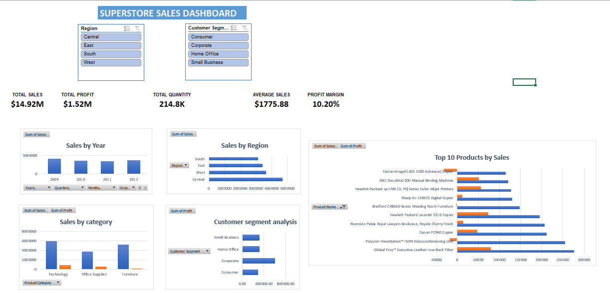

# Superstore Sales & Profit Analysis Dashboard

## 📊 Project Overview

An interactive Excel dashboard developed to analyze sales and profit performance using the Superstore dataset.

The dashboard provides insights into sales trends, profitability, customer segments, product categories, regions, discounts, and top-selling products.

## 📊 Dashboard

## 🛠️ Tools & Skills

- Microsoft Excel
- PivotTables
- PivotCharts
- Slicers
- Data Analysis
- Dashboard Design

## 📌 Key KPIs

| KPI | Value |
|---|---:|
| Total Sales | $14.92M |
| Total Profit | $1.52M |
| Total Quantity | 214,777 |
| Average Sales | $1,775.88 |
| Profit Margin | 10.20% |

## 🔍 Key Insights

- Corporate customers generated the highest sales and profit.
- Small Business had the highest profit margin at approximately 11.32%.
- Technology was the highest-selling product category.
- The top-selling product was Global Troy™ Executive Leather Low-Back Tilter.
- 3 of the top 10 products by sales generated negative profit.
- High sales volume does not necessarily translate into high profitability.
- Most discount observations were concentrated between 0% and 10%, while higher discount levels had very limited observations.

## 📈 Dashboard Features

- Sales by Year
- Sales by Region
- Sales by Product Category
- Sales by Customer Segment
- Top 10 Products by Sales
- Total Sales KPI
- Total Profit KPI
- Total Quantity KPI
- Average Sales KPI
- Profit Margin KPI
- Interactive Region Slicer
- Interactive Customer Segment Slicer

## 💡 Business Recommendations

- Monitor products that generate high sales but negative profit.
- Evaluate discount strategies to protect profit margins.
- Focus on high-performing customer segments and product categories.
- Use regional and customer-segment analysis to support business decisions.

## 📁 Project Files

- `dashbord_ Superstore Sales (Excel).xlsx` — Interactive Excel dashboard
- `dashboard.PNG` — Dashboard preview
